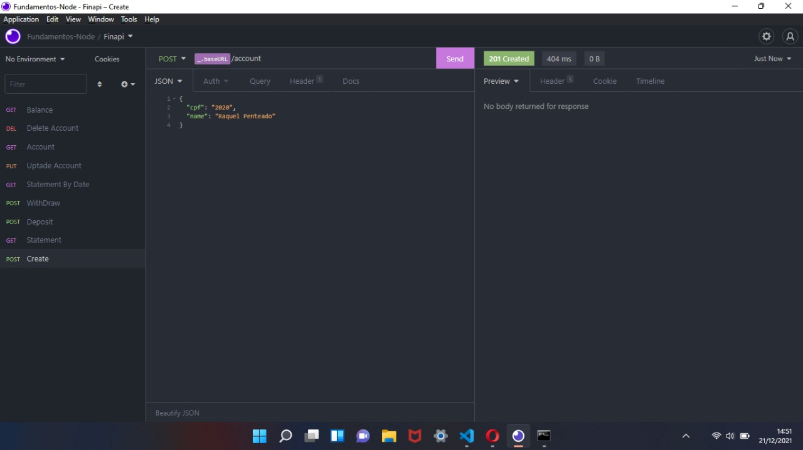
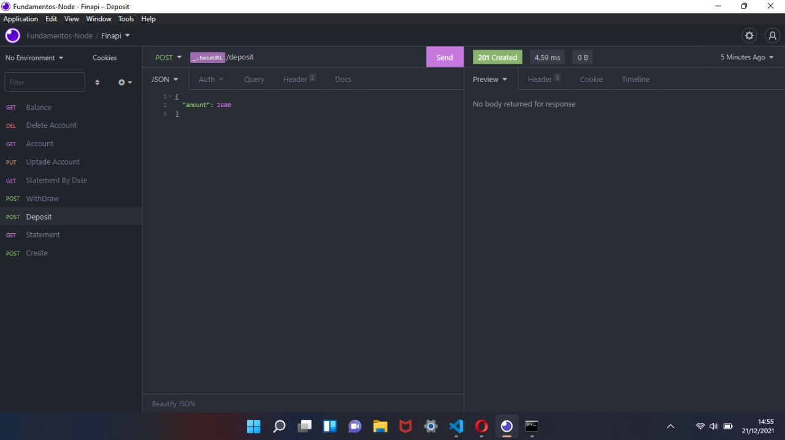

# FinAPI - Aplicação de criar conta e fazer depósitos

A FinAPI foi criado pela Rocketseat com o intuito de ensinar a tecnologia NodeJS utilizando o Insomnia

## Table of contents

- [Screenshots](#screenshots)
- [Author](#author)

### Screenshots

#### Alguns prints mostrando alguns das funcionalidades da aplicação.

#### Criação da conta

#### Criação de depósito

- Solution URL: 
- Live Site URL: 

## Author

- Rocketseat - [https://app.rocketseat.com.br/me/raquel-penteado-02954](https://app.rocketseat.com.br/me/raquel-penteado-02954)
- Twitter - [https://www.twitter.com/raquelpenteado](https://www.twitter.com/raquelpenteado)